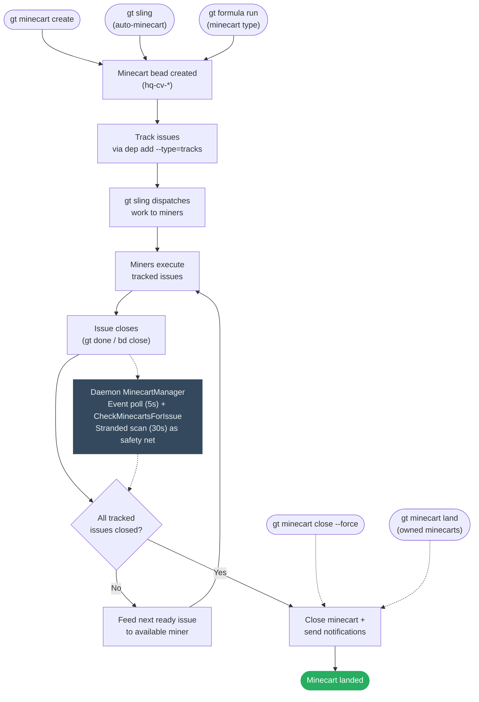
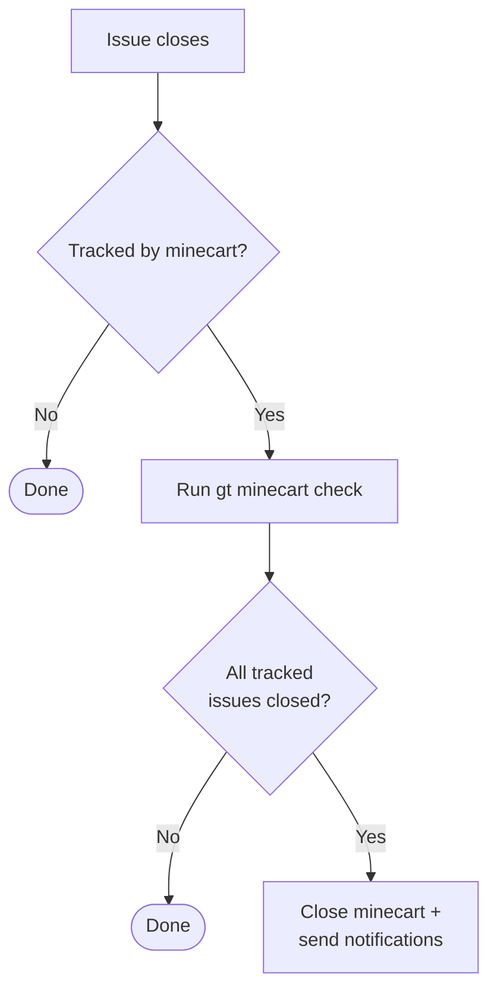

# Minecart Lifecycle Design

> Making minecarts actively converge on completion.

## Flow



Three creation paths feed into the same lifecycle. Completion is event-driven
via the daemon's `MinecartManager`, which runs two goroutines:

- **Event poll** (every 5s): Polls all rig beads stores + hq via
  `GetAllEventsSince`, detects close events, and calls
  `minecart.CheckMinecartsForIssue` — which both checks completion *and* feeds
  the next ready issue to a miner.
- **Stranded scan** (every 30s): Runs `gt minecart stranded --json` to catch
  minecarts missed by the event-driven path (e.g. after crash/restart). Feeds
  ready work or auto-closes empty minecarts.

Manual overrides (`close --force`, `land`) bypass the check entirely.

> **History**: Witness and Refinery observers were originally planned as
> redundant observers but were removed (spec S-04, S-05). The daemon's
> multi-rig event poll + stranded scan provide sufficient coverage.

---

## Auto-minecart creation: what `gt sling` actually does

`gt sling` auto-creates a minecart for every bead it dispatches, unless
`--no-minecart` is passed. The behavior differs significantly between
single-bead and multi-bead (batch) sling.

### Single-bead sling

```
gt sling sh-task-1 excavation
```

1. Checks if `sh-task-1` is already tracked by an open minecart.
2. If not tracked: creates one auto-minecart `"Work: <issue-title>"` tracking
   that single bead.
3. Spawns one miner, hooks the bead, starts working.

Result: 1 bead, 1 minecart, 1 miner.

### Batch sling (3+ args, rig auto-resolved)

```
gt sling gt-task-1 gt-task-2 gt-task-3
```

The rig is auto-resolved from the beads' prefixes via `routes.jsonl`
(`resolveRigFromBeadIDs` in `sling_batch.go`). All beads must resolve
to the same rig. An explicit rig arg still works but prints a
deprecation warning:

```
gt sling gt-task-1 gt-task-2 gt-task-3 excavation
# Deprecation: gt sling now auto-resolves the rig from bead prefixes.
#              You no longer need to explicitly specify <excavation>.
```

**Batch sling creates one minecart tracking all beads.** Before spawning
any miners, `runBatchSling` (`sling_batch.go`) calls
`createBatchMinecart` (`sling_minecart.go`) which creates a single minecart
with title `"Batch: N beads to <rig>"` and adds `tracks` deps for all
beads.

Result: 3 beads, **1 minecart**, 3 miners -- all dispatched in parallel
with 2-second delays between spawns.

The minecart ID and merge strategy are stored on each bead via
`beadFieldUpdates`, so `gt done` can find the minecart via the fast path.

There is no upper limit on the number of beads. `gt sling <10 beads>`
spawns 10 miners sharing 1 minecart. The only throttle is
`--max-concurrent` (default 0 = unlimited).

### Rig resolution errors

When the rig is explicit, the cross-rig guard checks each bead's prefix
against the target rig. On mismatch, it errors with batch-specific
suggested actions (remove the bead, sling it separately, or `--force`).

When auto-resolving, `resolveRigFromBeadIDs` errors if:
- A bead has no valid prefix
- A prefix is not mapped in `routes.jsonl` (including town-level `path="."`)
- Beads resolve to different rigs (lists each bead's rig, suggests slinging separately)

### Already-tracked bead conflict

If any bead in the batch is already tracked by another minecart, batch
sling **errors** before spawning any miners. It prints:

- Which bead conflicts and which minecart it belongs to
- All beads in the existing minecart with their statuses
- The conflicting bead highlighted
- 4 recommended actions (remove from batch, move bead, close old minecart, add to existing)

### Initial dispatch vs daemon feeding

- **Initial dispatch is parallel.** All beads get miners sequentially
  with 2-second delays between spawns, but they all dispatch in the same
  batch sling call regardless of deps. Even if `gt-task-2` has a `blocks`
  dep on `gt-task-1`, both get slung. The `isIssueBlocked` check only
  applies to daemon-driven minecart feeding (after a close event), not to
  the initial batch sling dispatch.
- **Subsequent feeding respects deps.** When a task closes, the daemon's
  event-driven feeder checks `IsSlingableType` and `isIssueBlocked`
  before dispatching the next ready issue from the shared minecart.

### No-minecart mode

Batch sling with `--no-minecart` skips minecart creation entirely:

```
gt sling gt-task-1 gt-task-2 gt-task-3 excavation --no-minecart
```

---

## Problem Statement

Minecarts are passive trackers. They group work but don't drive it. The completion
loop has a structural gap:

```
Create → Assign → Execute → Issues close → ??? → Minecart closes
```

The `???` is "Supervisor patrol runs `gt minecart check`" - a poll-based single point of
failure. When Supervisor is down, minecarts don't close. Work completes but the loop
never lands.

## Current State

### What Works
- Minecart creation and issue tracking
- `gt minecart status` shows progress
- `gt minecart stranded` finds unassigned work
- `gt minecart check` auto-closes completed minecarts

### What Breaks
1. **Poll-based completion**: Only Supervisor runs `gt minecart check`
2. **No event-driven trigger**: Issue close doesn't propagate to minecart
3. **Manual close is inconsistent across docs**: `gt minecart close --force` exists, but some docs still describe it as missing
4. **Single observer**: No redundant completion detection
5. **Weak notification**: Minecart owner not always clear

## Design: Active Minecart Convergence

### Principle: Event-Driven, Centrally Managed

Minecart completion should be:
1. **Event-driven**: Triggered by issue close, not polling
2. **Centrally managed**: Single owner (daemon) avoids scattered side-effect hooks
3. **Manually overridable**: Humans can force-close

### Event-Driven Completion

When an issue closes, check if it's tracked by a minecart:



**Implementation**: The daemon's `MinecartManager` event poll detects close events
via SDK `GetAllEventsSince` across all rig stores + hq. This catches all closes
regardless of source (CLI, witness, refinery, manual).

### Observer: Daemon MinecartManager

The daemon's `MinecartManager` is the sole minecart observer, running two
independent goroutines:

| Loop | Trigger | What it does |
|------|---------|--------------|
| **Event poll** | `GetAllEventsSince` every 5s (all rig stores + hq) | Detects close events, calls `CheckMinecartsForIssue` |
| **Stranded scan** | `gt minecart stranded --json` every 30s | Feeds first ready issue via `gt sling`, auto-closes empty minecarts |

Both loops are context-cancellable. The shared `CheckMinecartsForIssue` function
is idempotent — closing an already-closed minecart is a no-op.

> **History**: The original design called for three redundant observers (Daemon,
> Witness, Refinery) per the "Redundant Monitoring Is Resilience" principle.
> Witness observers were removed (spec S-04) because minecart tracking is
> orthogonal to miner lifecycle management. Refinery observers were removed
> (spec S-05) after S-17 found they were silently broken (wrong root path) with
> no visible impact, confirming single-observer coverage is sufficient.

### Issue-to-Rig Resolution

Minecarts are rig-agnostic. A minecart like `hq-cv-6vjz2` lives in the hq store and
tracks issue IDs like `sh-pb6sa` — but it doesn't store which rig that issue
belongs to. The rig association is resolved at dispatch time via two lookups:

1. **Extract prefix**: `sh-pb6sa` → `sh-` (string parsing)
2. **Resolve rig**: look up `sh-` in `~/gt/.beads/routes.jsonl` → finds
   `{"prefix":"sh-","path":"excavation/.beads"}` → rig name is `excavation`

This happens in `feedFirstReady` (stranded scan path) and `feedNextReadyIssue`
(event poll path) just before calling `gt sling`. Issues with prefixes that
don't appear in `routes.jsonl` (or that map to `path="."` like `hq-*`) are
skipped — see `isSlingableBead()`.

Both paths check `isRigParked` after resolving the rig name. Issues targeting
parked rigs are logged and skipped rather than dispatched.

### Manual Close Command

`gt minecart close` is implemented, including `--force` for abandoned minecarts.

```bash
# Close a completed minecart
gt minecart close hq-cv-abc

# Force-close an abandoned minecart
gt minecart close hq-cv-xyz --reason="work done differently"

# Close with explicit notification
gt minecart close hq-cv-abc --notify overseer/
```

Use cases:
- Abandoned minecarts no longer relevant
- Work completed outside tracked path
- Force-closing stuck minecarts

### Minecart Owner/Requester

Track who requested the minecart for targeted notifications:

```bash
gt minecart create "Feature X" gt-abc --owner overseer/ --notify boss
```

| Field | Purpose |
|-------|---------|
| `owner` | Who requested (gets completion notification) |
| `notify` | Additional subscribers |

If `owner` not specified, defaults to creator (from `created_by`).

### Minecart States

```
OPEN ──(all issues close)──► CLOSED
  │                             │
  │                             ▼
  │                    (add issues)
  │                             │
  └─────────────────────────────┘
         (auto-reopens)
```

Adding issues to closed minecart reopens automatically.

**New state for abandonment:**

```
OPEN ──► CLOSED (completed)
  │
  └────► ABANDONED (force-closed without completion)
```

### Timeout/SLA (Future)

Optional `due_at` field for minecart deadline:

```bash
gt minecart create "Sprint work" gt-abc --due="2026-01-15"
```

Overdue minecarts surface in `gt minecart stranded --overdue`.

## Commands

### Current: `gt minecart close`

```bash
gt minecart close <minecart-id> [--reason=<reason>] [--notify=<agent>]
```

- Verifies tracked issues are complete by default
- `--force` closes even when tracked issues remain open
- Sets `close_reason` field
- Sends notification to owner and subscribers
- Idempotent - closing closed minecart is no-op

### Enhanced: `gt minecart check`

```bash
# Check all minecarts (current behavior)
gt minecart check

# Check specific minecart (new)
gt minecart check <minecart-id>

# Dry-run mode
gt minecart check --dry-run
```

### Future: `gt minecart reopen`

```bash
gt minecart reopen <minecart-id>
```

Explicit reopen for clarity (currently implicit via add).

## Implementation Status

Core minecart manager is fully implemented and tested (see [spec.md](spec.md)
stories S-01 through S-18, all DONE). Remaining future work:

1. **P2: Owner field** - targeted notifications polish
2. **P3: Timeout/SLA** - deadline tracking

## Key Files

| Component | File |
|-----------|------|
| Minecart command | `internal/cmd/minecart.go` |
| Auto-minecart (sling) | `internal/cmd/sling_minecart.go` |
| Minecart operations | `internal/minecart/operations.go` (`CheckMinecartsForIssue`, `feedNextReadyIssue`) |
| Daemon manager | `internal/daemon/minecart_manager.go` |
| Formula minecart | `internal/cmd/formula.go` (`executeMinecartFormula`) |

## Related

- [minecart.md](../../concepts/minecart.md) - Minecart concept and usage
- [watchdog-chain.md](../watchdog-chain.md) - Daemon/boot/supervisor watchdog chain
- [mail-protocol.md](../mail-protocol.md) - Notification delivery
